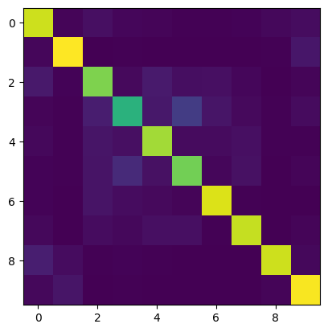

# cifar-10-cnn
a convolutional neural network trained for image classification on the cifar-10 dataset

## results
pre-training accuracy: 10.41% 
after 10 epochs: 79.3%

confusion matrix: 

### python libraries used:
- pytorch
- numpy
- matplotlib
- scikit learn

### ml/ai concepts:
- convolutional neural networks
- feed forward neural networks
- preprocessing
- batch normalization
- activation function (relu)
- max pooling
- dropout
- momentum-based gradient descent
- backpropogation
- cross entropy loss function
